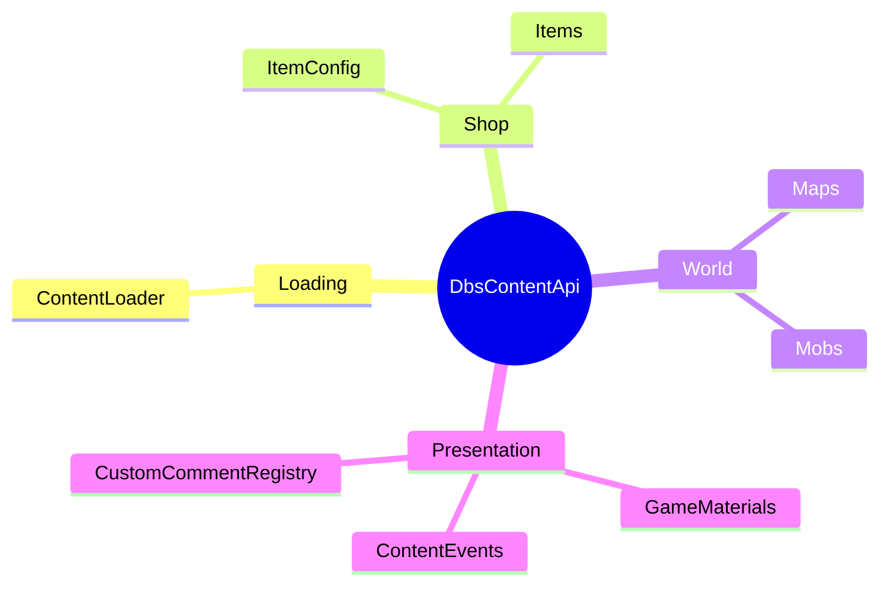

# API overview

Grouped index of the public DbsContentApi surface. Member-level documentation is generated from XML comments on each type.

> [!TIP]
> New to the SDK? Start with [Quick start](quick-start.md), then use this page as a map.

## Plugin & configuration

| Type | Description |
|------|-------------|
| [`DbsContentApiPlugin`](xref:DbsContentApi.DbsContentApiPlugin) | Singleton plugin; dev flags (`SetModdedMobsOnly`, `SetAllItemsFree`, …) and `TemporaryContentTriggerPrefab` |
| [`BaseCWInput`](xref:DbsContentApi.BaseCWInput) | Custom keybinds integrated with the settings menu |

## Content loading

| Type | Description |
|------|-------------|
| [`ContentLoader`](xref:DbsContentApi.ContentLoader) | Load AssetBundles and prefabs; register Photon pool entries |

**Tutorial:** [Asset bundles](concepts/asset-bundles.md)

## Items & shop

| Type | Description |
|------|-------------|
| [`Items`](xref:DbsContentApi.Items) | Register items, defer shop registration, custom categories |
| [`ItemConfig`](xref:DbsContentApi.ItemConfig) | Shop metadata, hold offsets, spawn settings, icons |
| [`CustomShopItemCategory`](xref:DbsContentApi.CustomShopItemCategory) | Custom shop tab descriptor |
| [`ImpactSoundType`](xref:DbsContentApi.ImpactSoundType) | Preset impact sound categories |

**Tutorial:** [Add a shop item](tutorials/add-shop-item.md)

## Monsters

| Type | Description |
|------|-------------|
| [`Mobs`](xref:DbsContentApi.Mobs) | Register monsters, bot helpers, attack wiring |
| [`MobSetupConfig`](xref:DbsContentApi.MobSetupConfig) | Master config for monster component setup |
| [`BudgetConfig`](xref:DbsContentApi.BudgetConfig) | Spawn budget and rarity |
| [`ControllerConfig`](xref:DbsContentApi.ControllerConfig) | PlayerController movement settings |
| [`PlayerConfig`](xref:DbsContentApi.PlayerConfig) | Capsule height, AI flag |
| [`RagdollConfig`](xref:DbsContentApi.RagdollConfig) | Ragdoll physics |
| [`PhotonViewConfig`](xref:DbsContentApi.PhotonViewConfig) | Network sync settings |
| [`BotConfig`](xref:DbsContentApi.BotConfig) | Patrol groups, alert behaviour |
| [`NavMeshAgentConfig`](xref:DbsContentApi.NavMeshAgentConfig) | NavMesh agent dimensions and speed |
| [`MonsterAnimationValuesConfig`](xref:DbsContentApi.MonsterAnimationValuesConfig) | Punch toggles, move multiplier |
| [`RigCreatorConfig`](xref:DbsContentApi.RigCreatorConfig) | Bodypart rig authoring |
| [`BotChaserConfig`](xref:DbsContentApi.BotChaserConfig) | Chase AI tuning |
| [`BotDragConfig`](xref:DbsContentApi.BotDragConfig) | Drag AI tuning |
| [`BotKnifoConfig`](xref:DbsContentApi.BotKnifoConfig) | Knife bot tuning |

**Tutorial:** [Add a monster](tutorials/add-monster.md)

## Maps

| Type | Description |
|------|-------------|
| [`Maps`](xref:DbsContentApi.Maps) | Register scenes, find paths, select map by ID |
| [`MapConfig`](xref:DbsContentApi.MapConfig) | Load pipeline: patrols, retexture, ambience |
| [`MapPipelineFlags`](xref:DbsContentApi.MapPipelineFlags) | Skip built-in pipeline phases |
| [`MapLifecycleHooks`](xref:DbsContentApi.MapLifecycleHooks) | Custom callbacks during map load |
| [`CustomMap`](xref:DbsContentApi.CustomMap) | Registered map descriptor |

**Tutorial:** [Add a map](tutorials/add-map.md) · **Concept:** [Multiplayer rules](concepts/multiplayer.md)

## Materials & visuals

| Type | Description |
|------|-------------|
| [`GameMaterials`](xref:DbsContentApi.GameMaterials) | Apply, batch, and clone in-game materials |
| [`GameMaterial`](xref:DbsContentApi.GameMaterial) | Enum of vanilla material assets |
| [`DescriptiveMaterial`](xref:DbsContentApi.DescriptiveMaterial) | Semantic color/material presets |
| [`MaterialApplicator`](xref:DbsContentApi.MaterialApplicator) | Fluent batch applicator from `GameMaterials.Batch` |

**Tutorial:** [Fix materials](tutorials/fix-materials.md)

## Filming & comments

| Type | Description |
|------|-------------|
| [`ContentEvents`](xref:DbsContentApi.ContentEvents) | Register custom filming event types |
| [`CustomCommentRegistry`](xref:DbsContentApi.CustomCommentRegistry) | Inject comment UI strings |
| [`CustomComment`](xref:DbsContentApi.CustomComment) | Single localized comment entry |
| [`ObjectHelper`](xref:DbsContentApi.ObjectHelper) | Spawn temporary content-trigger volumes |

**Tutorial:** [Content events & filming](tutorials/content-events.md)

## Utilities

| Type | Description |
|------|-------------|
| [`ObjectHelper`](xref:DbsContentApi.ObjectHelper) | Spawn temporary content-trigger volumes |

> [!NOTE]
> Some helper types (`GuidHelper`, `ImpactSoundScanner`, `TimedDestruction`) are used internally or via other APIs and may not appear as separate reference pages.

## Internal (not in reference)

Harmony patches under `DbsContentApi.Patches` are excluded from generated docs. Do not reference them from mods.

