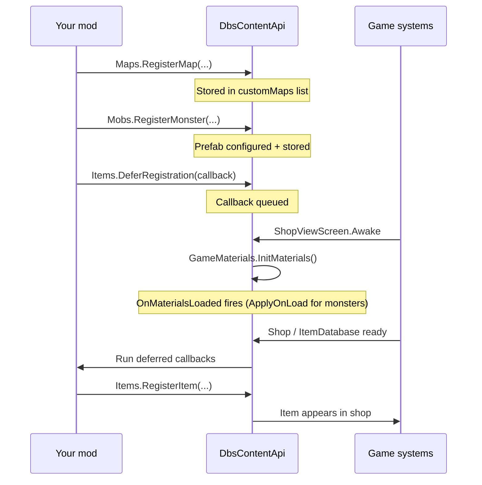

# Registration lifecycle

Understanding **when** your registration code runs prevents the most common "my item never appears" bugs.

## Call site: plugin constructor

Register content from your plugin constructor (or a static `Init()` called from there):

[!code-csharp[Plugin entry](../snippets/QuickStart.cs?name=PluginEntry)]

The game discovers your plugin via `[ContentWarningPlugin]`, runs Harmony on attributed types, then executes static constructors. That is the correct window for calling `CustomContent.Init()`.

> [!IMPORTANT]
> Do **not** defer all registration to Unity `Awake`/`Start` on a `MonoBehaviour` unless you know the game object exists that early. The SDK expects registrations during plugin load.

## What happens immediately vs later



| API | When it runs | When the game uses it |
|-----|--------------|----------------------|
| `Maps.RegisterMap` | Immediately at call time | Next round map selection / load |
| `Mobs.RegisterMonster` | Immediately (setup + store) | Round spawner budget phase |
| `Items.DeferRegistration` | Callback queued at call time | When shop initializes |
| `GameMaterials.InitMaterials` | When shop screen opens | Caches vanilla materials; runs `ApplyOnLoad` callbacks |
| `ContentEvents.RegisterEvent` | Immediately (store template) | Filming / comment systems |

## Items must defer

`Items.RegisterItem` touches the live `ItemDatabase`. Call it inside `Items.DeferRegistration`:

[!code-csharp[Defer registration](../snippets/QuickStart.cs?name=RegisterItem)]

Calling `RegisterItem` directly from `Init()` may run before vanilla items exist and fail silently or throw depending on game state.

## Maps and monsters register eagerly

`Maps.RegisterMap` and `Mobs.RegisterMonster` configure prefabs and store references immediately. That is safe during plugin load because the API only **reads** them when the spawner or map loader runs later.

Monster `material:` fixes are queued via `ApplyOnLoad` and applied when the shop opens (see [Fix materials](../tutorials/fix-materials.md)). In normal play every client opens the shop before diving, so materials are ready before custom monsters spawn.

## Development flags

Set these in your plugin constructor **before** `CustomContent.Init()` if you use them:

```csharp
DbsContentApiPlugin.SetAllItemsFree(true);      // shop prices → 0
DbsContentApiPlugin.SetModdedMobsOnly(true);    // only API monsters spawn
DbsContentApiPlugin.SetModdedMapsOnly(true);    // only API maps selectable
```

> [!TIP]
> Wrap flags in your mod's `DEBUG_MODE` so release builds behave like normal Content Warning.

## Failure modes

| Symptom | Likely cause |
|---------|--------------|
| Item missing from shop | Not inside `DeferRegistration`, or `Init()` returned early |
| Map works solo, wrong in MP | Different registration order or duplicate `mapId` on clients |
| Monster spawns without AI | Attack/chase on root instead of `Mobs.GetBotChildObject` |
| Bundle load fails | File not beside DLL or wrong bundle name constant |

See [Multiplayer rules](multiplayer.md) for map sync details.
