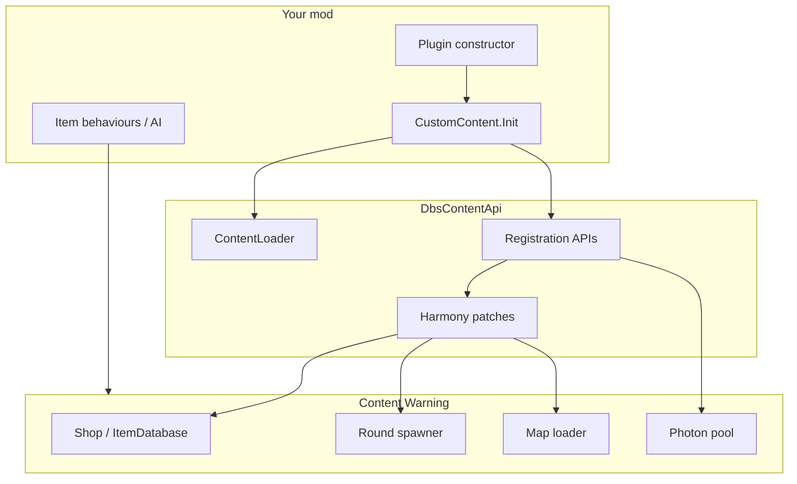

# SDK overview

DbsContentApi sits between your mod and Content Warning's internal systems. You call registration APIs during plugin load; the SDK stores your content and applies it when the game reaches the right lifecycle point.

## Your mod vs the SDK vs the game



## What the SDK handles for you

| Concern | Without DbsContentApi | With DbsContentApi |
|---------|----------------------|-------------------|
| Shop item wiring | Patch `ItemDatabase`, add components manually | `Items.RegisterItem` + `DeferRegistration` |
| Monster setup | Add controller, ragdoll, bot, nav mesh, sync | `Mobs.RegisterMonster` + `MobSetupConfig` |
| Custom maps | Hook scene load, patrol setup, dive bell | `Maps.RegisterMap` + optional `MapConfig` |
| Broken shaders | Find working in-game materials yourself | `GameMaterials.ApplyMaterial` / `ApplyOnLoad` |
| Photon prefabs | Register in `DefaultPool` manually | Done inside item/monster registration |

## What you still own

- **Unity authoring** — prefabs, scenes, icons, audio in AssetBundles
- **Gameplay logic** — `MonoBehaviour` components on items and monsters
- **Multiplayer correctness** — stable map IDs, consistent registration order across clients
- **Logging** — DbsContentApi logs internally as `[DbsContentApi]`; your mod needs its own logger

## Typical project layout

```
MyMod/
  MyMod.cs              ← plugin entry, calls CustomContent.Init()
  CustomContent.cs      ← load bundles, register everything
  CustomItems.cs        ← optional split when the mod grows
  CustomMobs.cs
  my_mod                ← bundle (no extension)
  my_map                ← optional scene bundle
```

Real examples: `CW_SDK`, `UnlistedEntities`, `RegionsExpanded` in the monorepo.

## Module map

| Module | Tutorial | API |
|--------|----------|-----|
| Load bundles | [Asset bundles](asset-bundles.md) | [ContentLoader](xref:DbsContentApi.ContentLoader) |
| Shop items | [Add a shop item](../tutorials/add-shop-item.md) | [Items](xref:DbsContentApi.Items) |
| Monsters | [Add a monster](../tutorials/add-monster.md) | [Mobs](xref:DbsContentApi.Mobs) |
| Maps | [Add a map](../tutorials/add-map.md) | [Maps](xref:DbsContentApi.Maps) |
| Shaders | [Fix materials](../tutorials/fix-materials.md) | [GameMaterials](xref:DbsContentApi.GameMaterials) |
| Filming | [Content events](../tutorials/content-events.md) | [ContentEvents](xref:DbsContentApi.ContentEvents) |

> [!NOTE]
> Internal Harmony patches under `DbsContentApi.Patches` are excluded from the public API reference. Do not depend on them from your mod.
