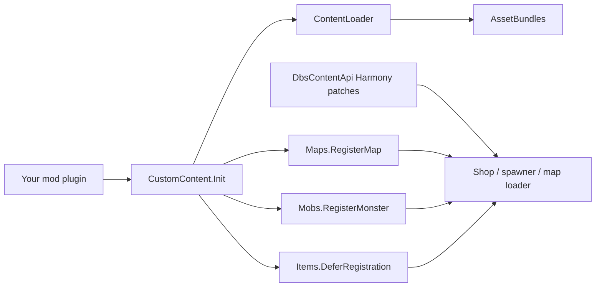

Content Warning
Mod SDK
Workshop dependency

# DbsContentApi

Register custom items, monsters, and maps in Content Warning without reimplementing Harmony patches, shop wiring, or spawn pipelines.

**Start here:** [Quick start](quick-start.md) (5 minutes) · [Installation](introduction.md) · [API overview](api-overview.md)

## At a glance

<strong>What it does</strong>
Loads your AssetBundles, registers content at the correct game lifecycle points, and exposes typed helpers for shop items, mobs, maps, materials, and filming events.

<strong>What you ship</strong>
Your mod DLL + bundle files (no extension) beside the DLL in the Workshop folder. Reference `DbsContentApi.dll` as a dependency.

<strong>What you write</strong>
A plugin constructor → `CustomContent.Init()` → load bundles → call `Items`, `Mobs`, and `Maps` registration APIs.

## How it fits together

## Choose your path

<h3>⚡ Quick start</h3>

Minimal Hello World mod: reference the DLL, load a bundle, register one item.

<a class="cw-card-link" href="quick-start.md">Start in 5 minutes →</a>

<h3>📖 Complete guide</h3>

Full walkthrough with real patterns from CW_SDK, UnlistedEntities, and RegionsExpanded.

<a class="cw-card-link" href="getting-started.md">Read the guide →</a>

<h3>🧩 Tutorials</h3>

Focused recipes: shop items, monsters, maps, materials, content events.

<a class="cw-card-link" href="tutorials/">Browse tutorials →</a>

<h3>💡 Concepts</h3>

Lifecycle, multiplayer rules, bundle layout, and how the SDK hooks into the game.

<a class="cw-card-link" href="concepts/">Learn concepts →</a>

<h3>📚 API reference</h3>

Grouped index of every public type with links to generated member docs.

<a class="cw-card-link" href="api-overview.md">Open API overview →</a>

<h3>🔧 Example mod</h3>

Working reference project in the monorepo: maps, mobs, guns, and dev flags.

<a class="cw-card-link" href="https://github.com/lcalero42/BDs-Content-API">View on GitHub →</a>

## Core modules

| Module | Use when you… |
|--------|----------------|
| [ContentLoader](xref:DbsContentApi.ContentLoader) | Load bundles and prefabs from disk |
| [Items](xref:DbsContentApi.Items) | Add shop items and custom categories |
| [Mobs](xref:DbsContentApi.Mobs) | Register monsters with AI and networking |
| [Maps](xref:DbsContentApi.Maps) | Ship custom playable scenes |
| [GameMaterials](xref:DbsContentApi.GameMaterials) | Fix pink/broken bundle shaders |
| [ContentEvents](xref:DbsContentApi.ContentEvents) | Hook filming / comment moments |
| [CustomCommentRegistry](xref:DbsContentApi.CustomCommentRegistry) | Inject custom comment UI text |

> [!IMPORTANT]
> Harmony patches under `DbsContentApi.Patches` are **internal**. Only use the public `DbsContentApi` namespace in your mod.

## Before you publish

> [!WARNING]
> Custom map registration order must match on **every client** in multiplayer. Use stable `mapId` values and never reorder maps after release.

> [!TIP]
> Gate `SetModdedMobsOnly`, `SetModdedMapsOnly`, and `SetAllItemsFree` behind your mod's debug flag — they are for local testing, not production defaults.
