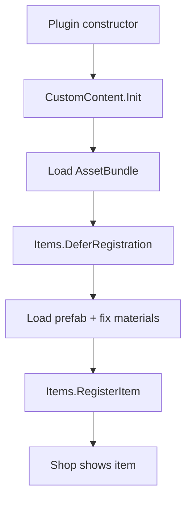

# Quick start

Get a custom shop item into Content Warning in about five minutes. This page covers the minimum path; see [Complete guide](getting-started.md) for maps, monsters, and advanced patterns.

## Prerequisites

- Content Warning + BepInEx modding environment
- `DbsContentApi.dll` referenced in your project ([Installation](introduction.md))
- One AssetBundle built in Unity with an item prefab inside

## 1. Wire up the plugin

Call your content registry from the plugin constructor:

[!code-csharp[Plugin entry](../snippets/QuickStart.cs?name=PluginEntry)]

> [!NOTE]
> DbsContentApi applies registrations through internal Harmony patches. You do **not** need to wait for Unity `Awake`/`Start`.

## 2. Load a bundle

Bundles must sit **next to your mod DLL** with **no file extension**:

```
MyMod/
  MyMod.dll
  my_mod          ← AssetBundle file
```

[!code-csharp[Load bundle](../snippets/QuickStart.cs?name=LoadBundle)]

> [!WARNING]
> If `LoadAssetBundle` returns `null`, check the filename and folder layout before debugging item code.

## 3. Register a shop item

Shop items must use `Items.DeferRegistration` so the vanilla item database is ready first:

[!code-csharp[Register item](../snippets/QuickStart.cs?name=RegisterItem)]

`RegisterItem` automatically adds `ItemInstance`, `HandGizmo`, and Photon pool registration.

## 4. Fix materials (usually required)

Unity bundle shaders often render pink in-game. Apply a game material before registering:

[!code-csharp[Apply material](../snippets/QuickStart.cs?name=ApplyMaterial)]

## 5. Build and test

1. Copy your DLL and bundle into the game's mod folder (or use `CW_SDK` deploy scripts).
2. Launch Content Warning and open the shop.
3. Look for your item under the category you registered.

> [!TIP]
> Enable `DbsContentApiPlugin.SetAllItemsFree(true)` during development so you can buy test items instantly.

## What next?

| Goal | Read |
|------|------|
| Understand timing and lifecycle | [Registration lifecycle](concepts/lifecycle.md) |
| Add a monster | [Add a monster](tutorials/add-monster.md) |
| Ship a custom map | [Add a map](tutorials/add-map.md) |
| Browse all public types | [API overview](api-overview.md) |
| Full reference walkthrough | [Complete guide](getting-started.md) |


